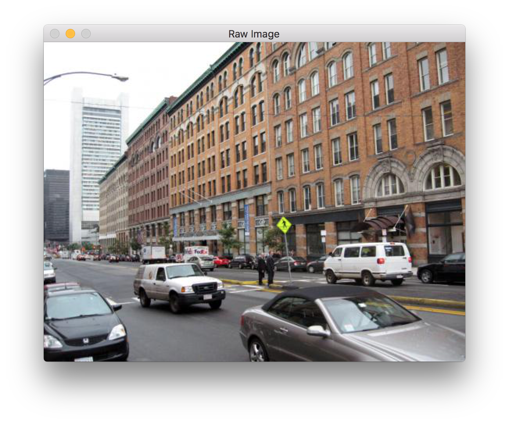
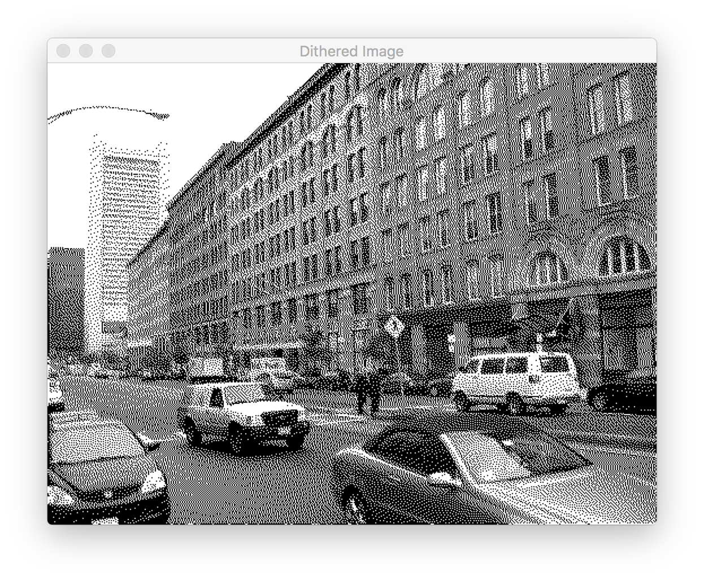

# Dithering-OpenCV
'Floyd-Steinberg' dithering algorithm implementation in C++

See <https://en.wikipedia.org/wiki/Floyd%E2%80%93Steinberg_dithering> for additional details.

## Results

## OpenCV 3.1.0 installation for OSX

After downloading the latest release from <https://github.com/Itseez/opencv/archive/3.1.0.zip> run the following commands in the terminal.

	cmake -DWITH_IPP=ON -DINSTALL_CREATE_DISTRIB=ON . && make -j $(nproc)
	sudo make install
