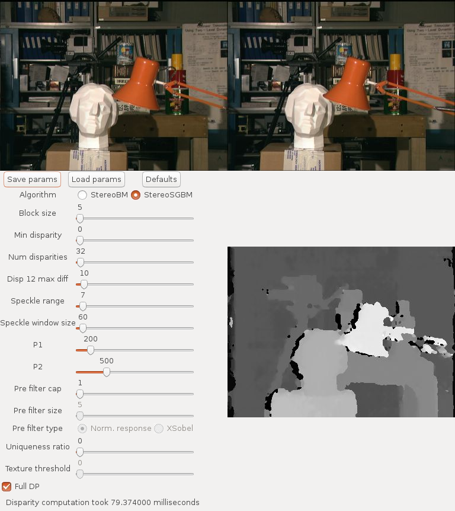

# Stereo Tuner
This is my modified version of [Martin Peris](http://blog.martinperis.com/)'s [StereoBM Tuner](http://blog.martinperis.com/2011/08/opencv-stereo-matching.html).

This is a simple little GTK application that can be used to tune parameters for the [OpenCV](http://opencv.org/) Stereo Vision algorithms.

## Screenshot

## New features
- **New algorithms:** this application supports both the StereoBM and StereoSGBM algorithms
- **Save and load parameters:** save your settings to a YAML or XML file that can be read by the `read` method of `StereoBM` or `StereoSGBM`. The same file can be used to restore the parameters on the Tuner.
- **Tooltips:** the parameter labels now display tooltips explaining them. Some of them were taken from the OpenCV documentation, and the ones that are not explained there were taken from somewhere else.
- **Execution time:** a (not very useful) indicator of the algorithm execution time on the status bar
- **New Glade file:** the Glade file was recreated from scratch and works with the recent versions of Glade.
- **OpenCV 3.0:** the program now uses OpenCV 3.0 and its C++ API (no more `IplImage`s).
- **Undistortion and rectification:** use your calibration files to undistort and rectify images.

## Installation
Make sure you have GTK3.0, GModule2.0 and OpenCV3.0 installed on your system, as well as a C++ compiler. Then, execute the following:

    wget https://github.com/guimeira/stereo-tuner/releases/download/v0.3/stereo-tuner.tar.gz
    tar zxvf stereo-tuner.tar.gz
    cd StereoTuner
    make
    ./main
    
## Usage
The user interface should be very intuitive, all you have to do is to adjust the parameters and see the resulting disparity image instantly.

You can use your own pair of images by using the command line parameters `-left` and `-right`. For example:

    ./main -left my_left_image.png -right my_right_image.png
    
If your images are not undistorted and rectified, provide your calibration files as follows:

    ./main -left my_left_image.png -right my_right_image.png -intrinsics my_intrinsics_file.yml -extrinsics my_extrinsics_file.yml
    
The intrinsics and extrinsics files must be a YML or XML generated by OpenCV. The intrinsics file must contain the matrices M1, D1, M2 and D2, the camera and distortion matrices for the left and right cameras. The extrinsics file must contain the R and T matrices, corresponding to the rotation and translation of one camera relative to the other. Those files can be generated by the program `samples/cpp/stereo_calib.cpp` available on the OpenCV source code.

## Future work
There's a lot of stuff that I'd like to do to improve this application, but I'm not sure if/when I'll have time to do that. Here's a list of new features that could be interesting:
- Select left and right images on the GUI
- Use other sources (webcams, video files, etc)
- **[Done!]** Save the parameters in the format that can be loaded by the `read` method of `StereoBM` and `StereoSGBM`
- **[Done!]** Read parameters in that same format
- Binary releases (.deb, .rpm, maybe even Windows)
- Do the heavy processing on a separate thread to avoid freezing the interface
- Refactor code to avoid repetitions
- Add support for other stereo-related stuff such as camera calibration, rectification, undistortion, etc, and then give this application some fancy name

## Bugs, issues, new features
Please, feel free to open an issue if you find a bug or you have a feature request. You can also fork this project and submit a pull request.

## Changelog
- **v0.3:** Support for calibration files.
- **v0.2:** Added load and save features.
- **v0.1:** First version.
